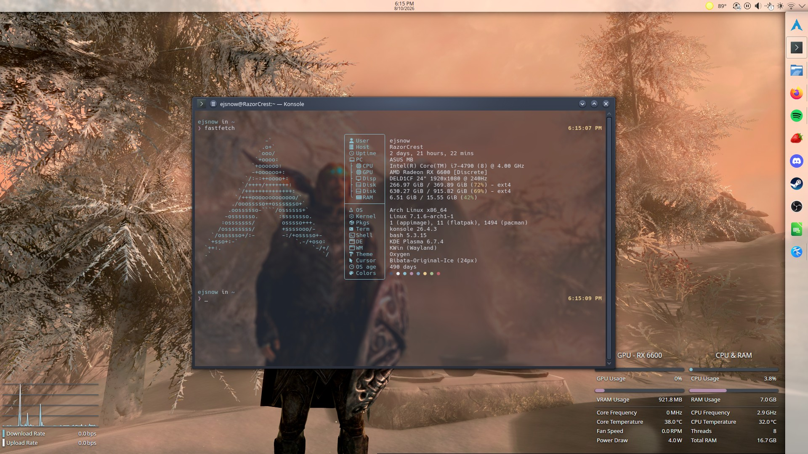

# My KDE Plasma dotfiles

My personal KDE Plasma dotfiles. In case my arch installs get corrupted or something. I use these configs on Arch Linux but they're pretty generic and should work on most distros.

NOTE: This exists mostly so I can easily restore my configs on a fresh Arch Linux installation. I won't provide support if you try to use these dotfiles on your own system. Some things might not apply and stuff may break. Use at your own risk.

The color schemes are based off of these: [Nord Light](https://store.kde.org/p/1833603) and [Nord Dark](https://store.kde.org/p/1833604). I just edited them to have bolder accent colors and different colors for inactive window title bars.

The Konsole theme is the official [Nord Konsole](https://github.com/nordtheme/konsole) color theme.

i am planning to automate installation via a script but until I figure that out here's manual installation instructions:

## Installation/Usage

1. Download or git clone this repo anywhere. Download link: [here](https://github.com/EJSnow/dotfiles/archive/refs/heads/main.zip)

2. Install dependencies (desktop effects/cursor theme/font/etc) (A functional KDE Plasma installation is assumed):

```
yay -S --needed bibata-cursor-theme blesh-git btop fastfetch oxygen oxygen5 kwin-effects-geometry-change starship ttf-hack-nerd ttf-oxygen-gf
```

3. Copy everything inside the `home` folder to your home folder (`~`). If asked, merge/overwrite existing folders/files. NOTE: This folder might appear to be empty, that's because all the files in it are hidden. Press Ctrl+H in your file manager to show hidden files or on the command line, `ls -a` will show hidden files.

4. Apply the "OxyNord" global theme from KDE system settings with "Desktop and window layout" enabled. Then sync the settings with PLM. Log out and log back in for changes to fully apply.

That's it!



## Additional Links

I'm beginning the process of migrating to Fedora KDE (got tired of random KDE apps dying on Arch for NO REASON) and I had to hunt some of these things down as getting them works a little differently on Fedora (particularly ble.sh, as there's no package for it on Fedora). Eventually I'll properly port my configs to Fedora but for now these are handy to get all the dependencies

* [Geometry Change KWin effect (alternate)](https://store.kde.org/p/2136283)
* [Starship Terminal prompt](https://starship.rs/)
* [Ble.sh Line Editor](https://github.com/akinomyoga/ble.sh?tab=readme-ov-file)
* [Oxygen font (Google Fonts)](https://fonts.google.com/specimen/Oxygen)
* [Oxygen Mono font (possibly switching from Hack)](https://fonts.google.com/specimen/Oxygen+Mono)
